# Hybrid Forecasting–Anomaly Detection for Telecom Site Energy Monitoring

*A re-application of Metry, Sharma, Allawi, Balog & Benotsmane, "Hybrid Forecasting-Anomaly Detection Approach for Smart Building Energy Monitoring," to the raw power-system data of a telecom site fleet.*


> **Summary.** The paper's hybrid framework (LSTM forecasting + LSTM-autoencoder anomaly detection, KDE thresholds, OR/AND fusion, indicator-based root-cause analysis) was re-applied to **1,332 telecom sites × 524 days** of daily rectifier, RAN and weather data.
>
> * **Forecasting.** The LSTM reaches day-ahead **MAE 61.6 W, RMSE 117.8 W, MAPE 1.32 %, R² 0.996** (paper: 61.1 W, 135.8 W, 0.97 %, 0.967).
>   * Pooled R² is near 1 even for "tomorrow = today". The informative figures are a 29 % MSE gain over persistence and a median per-site R² of 0.64.
>   * A linear model with the same inputs does as well or better.
> * **Autoencoder.** It reconstructs six DC-plant health indicators with R² 0.84. The autoencoder alone flags 5.9 % of test site-days; the **hybrid AND** rule flags **1.1 %**, close to the 1.32 % the paper's autoencoder flagged; the OR rule flags 9.8 %.
> * **Validation the paper could not do.**
>   * Hybrid OR detects **84 % of 2,613 injected faults**; the forecaster alone catches 47 % and the autoencoder alone 66 %, because their blind spots differ.
>   * AND-flagged days are **32× enriched for real mains outages** and **12× for load-disconnection (LLVD) events**. Neither event is a model input.
> * **Root causes.** The DC-plant counterparts of the paper's THD findings are rectifier conversion ratio, DC bus voltage, load swing and battery discharge.
> * **Fleet scale required three additions the single-panel study did not need:**
>   * window-level normalisation of non-stationary site loads;
>   * removal of fleet-wide weather / holiday shocks, which account for 30 % of forecast flags;
>   * a stricter threshold: the 99.5th percentile cuts alarms 85 % and keeps 76 % of recall.

---

## 1. From one building panel to a fleet of telecom sites

The paper monitors **one electrical panel** of a university building with a Fluke 935 logger for ~50 days. It (i) forecasts active power with an LSTM, (ii) learns "normal" power-quality behaviour with an LSTM autoencoder, (iii) flags a sample when the forecast residual **or/and** the reconstruction error exceeds a KDE-derived threshold, and (iv) explains each flag with domain indicators (THD, harmonics, unbalance).

This study keeps that workflow and every one of its decisions, but applies it to the data we actually have: **daily rectifier (DC power-plant) KPIs from 1,570 telecom sites over 524 days**, joined with RAN energy/traffic counters, regional weather, site configuration and the hardware inventory. The goal is not a one-to-one copy but the same principles applied where they make physical sense.

| Paper concept | This study |
|---|---|
| Fluke Power Log, one panel, ~50 days, 70,621 samples | NMS daily exports: rectifier KPIs for 1,570 sites, 2025-01-01 → 2026-06-08 (524 days), 669,893 observed site-days on the 1,332 modelled sites |
| 32 electrical quantities (V, I, f, P, Q, PF, THD, harmonics per phase) | 63 exported columns → 33 candidate quantities (DC load, supply sources, battery, thermal, RAN energy, traffic, weather) |
| Forecast target: *Active Power AN Avg* | *Avg DC Load Power* per site-day (kW) |
| Forecast inputs: Vrms, current, frequency, PF, active power | DC load, ambient temperature, ambient humidity, traffic, RAN board energy (+ day-of-week) |
| Autoencoder inputs (power quality): THD-V, THD-A, unbalance, harmonic pollution, 5th harmonics V/A | Power-system **health indicators**: rectifier conversion ratio, load swing, DC bus voltage, battery discharge hours, battery temperature, DC/RAN energy ratio |
| Root-cause indicators: THD, harmonics, unbalance | Mains outage, LLVD/BLVD operation, battery thermal stress, conversion, voltage, swing, DC-vs-RAN meter mismatch, traffic, hardware changes, DG abnormal runtime |
| One panel, one model | One *global* forecaster and one *global* autoencoder shared by 1,332 sites (site-relative scaling), plus a representative site for the paper-style single-unit figures |

The representative site (the analogue of the paper's single panel) is chosen by a fixed rule **before any modelling**: an outdoor, grid-fed site with a battery-temperature sensor, the longest record, and mean load closest to the fleet median — `SITE__135298474` (4.91 kW vs fleet median 4.91 kW; 18 4G and 9 5G cells).

**Workflow** (the paper's Fig. 1 / Algorithm 1, as implemented here):

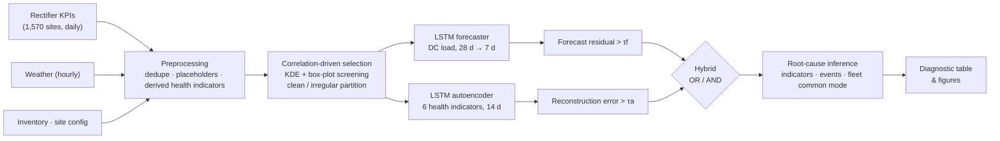

### What was kept from the paper

* The workflow of Fig. 1 / Algorithm 1: preprocessing → correlation-driven selection → distribution and outlier analysis → partition into clean vs irregular sequences → LSTM forecaster → LSTM autoencoder → OR/AND fusion → root-cause inference.
* Forecaster configuration (Table II): stacked LSTM with dropout 0.2 after each LSTM layer, batch 64, Adam (lr 0.001), MSE loss, 20 epochs, chronological 80/20 split.
* Autoencoder: sequence-to-sequence LSTM encoder → latent bottleneck → LSTM decoder → time-distributed dense output, trained on clean data only, scored by reconstruction MSE.
* Thresholds: 95th percentile of a KDE fitted to the error distribution of clean data.
* Outlier screening by KDE + box plots, and 11 selected features (5 forecasting + 6 health).

### What was adapted, and why

| # | Change | Reason |
|---|---|---|
| 1 | Look-back 60 → **28 days**, direct **7-day** multi-output | Data are daily; 28 days covers four weekly cycles. Algorithm 1 already writes P(t+1)…P(t+h). A 14/28/60-day sensitivity run is reported. |
| 2 | **Global models across sites** with site-relative scaling | 1,332 sites × ~500 days; one model per site would have ~400 training samples each. Inputs are expressed relative to each site's own training-period level, so the models learn "normal for this site". |
| 3 | **Window-level (instance) normalisation** of load, traffic and RAN energy in the forecaster | Site loads are non-stationary (seasonal cooling, growth, hardware step changes; one site runs at 4.7× its training mean). Without it the LSTM was *worse than persistence* (kept as an ablation, §4.1). |
| 4 | Thresholds fitted on **held-out validation days**, not training errors | Training errors are optimistic; the last 10 % of the training period is never used for gradient updates. |
| 5 | **Causal scoring**: a day's anomaly score uses only data up to that day | Keeps the detector usable in real time, which is the paper's stated objective. |
| 6 | **Baselines and per-site R²** added to the evaluation | Daily site load is highly persistent and differs a lot between sites, so a pooled R² near 1 is guaranteed and uninformative (§4.1). |
| 7 | **Fault injection and operational events** used to validate detection | The paper had no labels; this fleet has neither, but realistic synthetic faults and logged events (LLVD trips, outages, hardware swaps) make detection measurable. |
| 8 | Masked reconstruction loss | Some sites lack a battery-temperature sensor; missing channels are excluded from the loss and the score instead of being imputed. |

---

## 2. Data acquisition

| Dataset | Content | Use |
|---|---|---|
| DS01 Rectifier data (3 parts, 867,257 rows, 63 columns) | Daily per-site DC load (avg/max/min current and power), energy input, mains / DG / solar supply, battery discharge, LLVD/BLVD, fuel, battery and indoor climate, plus NMS counters `ENERGYBOARD`, `ENERGYLTE`, `ENERGYNR`, `TRAFFIC_GB` | Core telemetry ("Fluke log" analogue) |
| DS02 Site locations (49,693 cells, 2,643 sites) | Cell counts per technology, site type, anonymised coordinates | Site attributes |
| DS03 Site inventory (175,379 boards) | Board types and `FIRSTPOWERONTIME` | Hardware-change events for root-cause analysis (5,589 board power-ons inside the study window) |
| DS04 Weather (14,088 hourly records, one regional station, UTC+3) | Temperature, humidity, wind, pressure, UV | Exogenous drivers |

The fleet: 1,058 grid-fed sites, 414 diesel-generator (DG) sites with battery cycling, 90 DG + solar hybrids and 8 others. Of the 1,332 modelled sites, 1,079 are outdoor cabinets (mean load 5.1 kW) and 238 are indoor shelters (mean load 1.6 kW).

---

## 3. Methodology

### 3.1 Preprocessing and feature engineering (paper §III-B)

| Step | Effect |
|---|---|
| Date parsing | The exports mix `01/06/2026` and `1/13/2026` (an Excel locale artefact). File order proves both are month-first. |
| Exact duplicates | 152,345 repeated export rows removed (17.6 % of the raw rows). |
| Percent strings | `"100%"`-style text converted to numbers. |
| Column pruning | 25 columns dropped: all-empty (outdoor temperature, total traffic, indoor temperature duration), constant (site grade, load work mode, subnet), or exact copies (site fuel = DG fuel, daily-average outage = mains outage). |
| Dual power systems | 3 sites report two rectifier systems per day; extensive quantities summed, intensive ones averaged. |
| Placeholder replacement | 4,120 values set to missing: physical limits (e.g. 14,189 kW "average load" on a ~5 kW site, 96,500 L of daily fuel), 973 power/current pairs whose implied bus voltage falls outside the 40–60 V envelope of a 48 V plant, and 1,374 NMS counters reporting exactly zero while the rectifier shows load. |
| Calendar | Complete site × day grid; 13.2 % of site-days have no export. |
| Integration | Weather aggregated to daily mean/max; hardware power-on events and day-of-week encodings joined. |
| Missing values | Gaps ≤ 3 days linearly interpolated *inside* a site for model inputs only; interpolated days are never scored or evaluated. Longer gaps break sequences. |
| Site selection | 1,332 of 1,570 sites have ≥ 240 observed training days and ≥ 30 test days. |

Four health indicators are derived because the raw export has no direct power-quality fields:

* **DC bus voltage** = P / I. Float-charged grid sites sit at ~53.5–54.5 V; battery-cycled DG sites average ~50 V.
* **Conversion ratio** = DC load energy / total AC energy input. It is ~0.97 when the rectifiers carry the load, drops while batteries recharge, and exceeds 1 while batteries supply the load.
* **Load swing** = (P_max − P_min) / P_avg, the intra-day load distortion. It plays the role of the paper's current-distortion indicators.
* **DC/RAN energy ratio** = rectifier DC energy / RAN board energy reported by the NMS. Two independent meters of overlapping loads; a change reveals non-radio load changes (cooling, transmission) or metering faults. It is the analogue of phase unbalance, a consistency check between measurements.

### 3.2 Correlation heatmap and feature selection (paper §III-C, Fig. 4, Table I)

Correlations were computed **within sites** (each site's mean removed). A pooled correlation mixes between-site differences (big sites have more of everything) with the temporal co-movement that forecasting and anomaly detection actually exploit. The pooled matrix is kept as a supplementary figure.

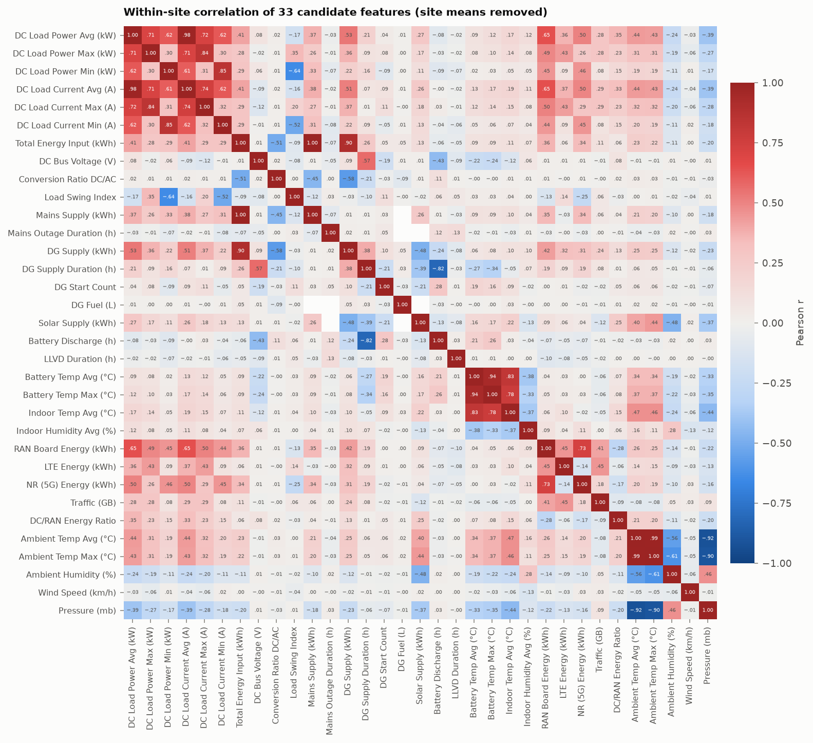

**Table I — correlation observations and selection decisions**

| Feature group | Observation (within-site r) | Recommendation |
|---|---|---|
| DC load power vs current (avg/max/min) | P vs I r = 0.98; the bus voltage is near-constant so P = V·I | Keep Avg DC Load Power as the target; drop the currents. DC Load Energy = 24·P exactly → drop |
| Total energy input vs DC load | r = 0.41; diverges on battery charge/discharge days | Not a forecasting input; used as the conversion-ratio denominator |
| RAN board energy vs LTE / NR energy | r = 0.45 / 0.73 | Keep the aggregate RAN board energy (r = 0.65 with load); drop the LTE/NR split |
| Traffic vs load | r = 0.28 with load, 0.41 with RAN energy | Retain traffic as the demand driver |
| Ambient temperature avg/max, pressure, UV | avg vs max r = 0.99; avg temp vs load r = 0.44; pressure vs temp r = −0.92 | Keep avg ambient temperature (cooling-load driver); drop max/pressure/UV (seasonal proxies) |
| Ambient humidity | r = −0.24 with load, −0.56 with temperature | Retain: partly independent weather signal |
| Battery vs indoor temperature | r = 0.83; indoor sensors cover only ~59 % of site-days | Keep battery temperature (thermal-stress indicator); drop indoor climate |
| Battery discharge vs DG hours / mains outage | r = −0.82 / 0.12 | Keep battery discharge (valid for every power configuration); outage, DG and LLVD kept as root-cause indicators |
| DC bus voltage | r = −0.43 with discharge, 0.08 with load | Retain: voltage quality, largely independent of load |
| Conversion ratio, load swing, DC/RAN ratio | max \|r\| with the other selected features: 0.11 / 0.17 / 0.35 | Retain all three: unique health information |

The same logic as the paper's Table I applies. Redundant pairs keep one representative; weakly correlated quality indicators are kept because they carry information nothing else does. One finding has no counterpart in the building study: **fleet-median DC load tracks ambient temperature with r = 0.92 day-to-day**, and the per-site correlation is 0.71 at outdoor cabinets vs 0.05 at indoor shelters. Outdoor cabinets cool themselves with DC-powered fans and heat exchangers, while indoor shelters use AC air-conditioning on a separate supply.

### 3.3 Distribution analysis (paper §III-D, Fig. 5)

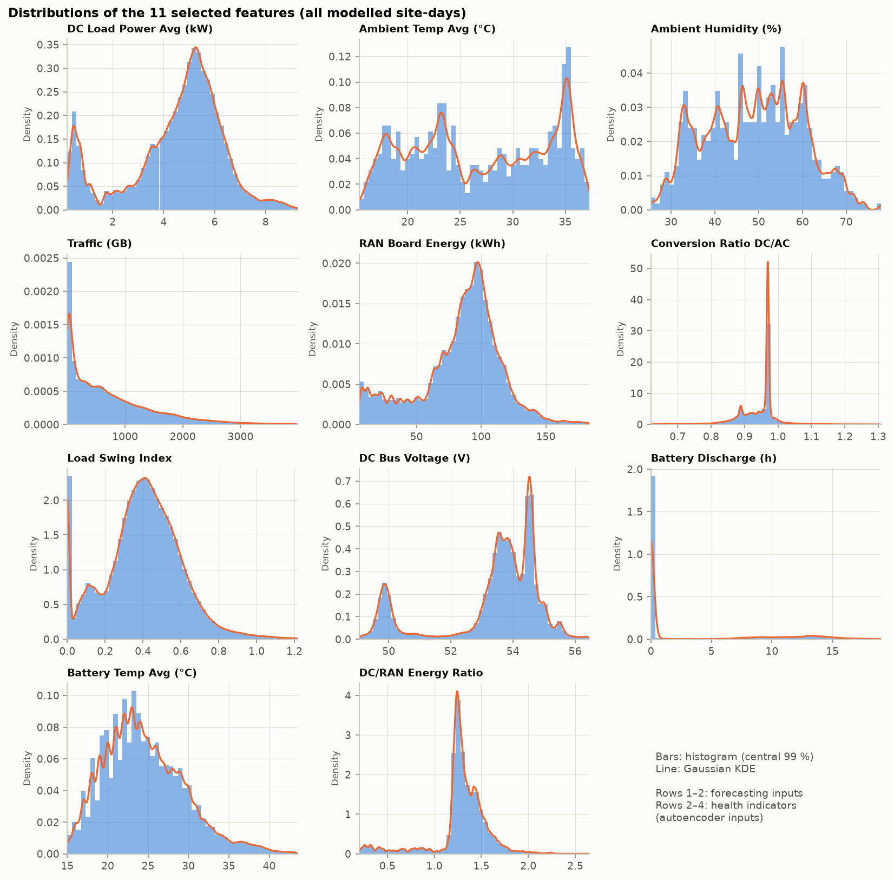

As in the paper, load-type quantities are roughly unimodal within the main population. The secondary mode near 0.5 kW is the indoor small-cell population. Quality indicators are long-tailed or multimodal:
* **Conversion ratio** is a needle at 0.97 with a secondary mode at ~0.89 (battery-cycled DG sites) and long tails.
* **Battery discharge** is zero at grid sites and spread between 5 and 18 h at DG sites.
* **DC bus voltage** is bimodal (50 V cycled vs 54 V float).

Multimodality across sites is what motivates the site-relative scaling used everywhere below.

### 3.4 Outlier detection and dataset partition (paper §III-E, Fig. 6)

All modelled features are expressed site-relatively: x / site mean − 1 for load, traffic and RAN energy, x − site median for health indicators. Each is then scaled by its fleet-wide (1–99 % winsorised) standard deviation, using statistics from the training period only. A value is an outlier only when **both** screens agree:

* **Box plot:** outside the site's own Tukey fences (Q1 − 1.5 IQR, Q3 + 1.5 IQR, training period).
* **KDE:** inside the low-density region of the pooled KDE that holds 1 % of the probability mass (Fig. 6b, red).

The box plot alone flags 4–11 % of values per feature, because tight per-site IQRs make it over-sensitive. The KDE alone flags about 1 %. Their consensus flags 0.3–0.8 % per feature. Weather is screened out of the irregular-day definition because a heat wave is not a site fault.

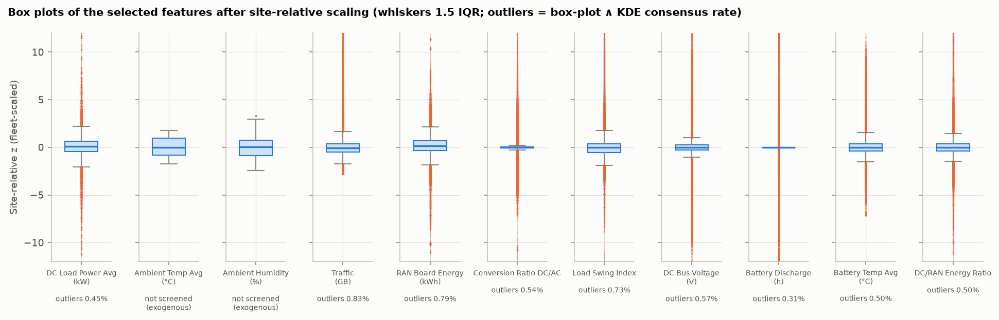
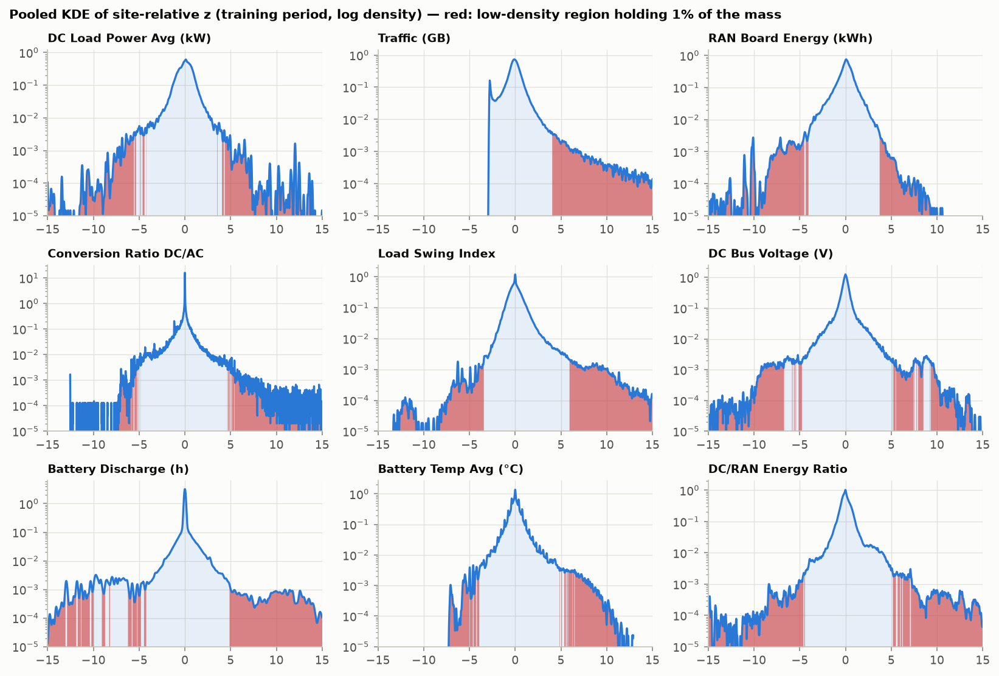

| Partition | Count |
|---|---|
| Site-days with reported load (modelled sites) | 669,893 (+19,761 interpolated input days, never scored) |
| Irregular site-days (any consensus outlier) | 29,936 (3.6 % of training-period days) |
| Forecasting partition: clean 35-day sequences (28 in + 7 out), training period | 407,477 (40,493 discarded as irregular) |
| Anomaly-detection partition: clean 14-day sequences, training period | 418,337 (58,236 discarded) |

Irregular days cluster in time, so excluding every sequence that touches one still keeps ~90 % of sequences. The forecaster and the autoencoder each screen on their own feature set. Irregular sequences are never used for training; they are what the detectors are meant to find.

### 3.5 LSTM forecaster (paper §III-F, Table II)

| Parameter | Paper | This study |
|---|---|---|
| Inputs | 5 features | 5 features (DC load, ambient temp, ambient humidity, traffic, RAN energy) + 3 day-of-week encodings |
| Time window | 60 steps | 28 days (sensitivity: 14 / 28 / 60) |
| Output | next step | next 7 days (direct); headline metrics on day-ahead |
| Architecture | LSTM layers, dropout 0.2 after each | LSTM(64) → dropout 0.2 → LSTM(32) → dropout 0.2 → Dense(7) |
| Batch / optimiser / LR / loss / epochs | 64 / Adam / 0.001 / MSE / 20 | identical; weights of the best validation epoch kept |
| Split | 80/20 chronological | 80/20 chronological by date (test from 2026-02-24); last 10 % of the training period (from 2026-01-13) held out for validation and thresholds |
| Scaling | normalised | window-level: load, traffic and RAN energy relative to their own last-7-day mean; weather z-scored |

Baselines (same test days): persistence P(t), same-weekday P(t−6), 7-day mean, and a **linear ARX** (ridge regression on exactly the same flattened 28-day input windows).

### 3.6 LSTM autoencoder (paper §III-G)

Six health indicators over 14-day windows:
* LSTM(32) → LSTM(16) gives the latent vector.
* The latent vector is repeated over 14 steps, then LSTM(16) → LSTM(32) → time-distributed Dense(6) reconstruct the window.
* Dropout 0.2, batch 64, Adam 0.001, masked MSE, 20 epochs.
* Training uses only clean windows from the training period.

A day's score is the reconstruction error of the **last** step of the window ending that day (causal). The threshold τa is the 95th percentile of a Gaussian KDE fitted to the errors of clean, held-out validation days.

### 3.7 Hybrid decision and root-cause inference (paper Algorithm 1)

* **Forecast residual:** R_f(d) = |P(d) − P̂(d)| divided by the forecast window's own load level and by the fleet scale of window-relative deviations. This is a local, fleet-comparable z-score. τf is the KDE 95th percentile on clean validation days.
* **Flags:** A_f = R_f > τf and A_a = R_a > τa. A_OR = A_f ∨ A_a for sensitivity; A_AND = A_f ∧ A_a for high confidence.
* **Episodes:** consecutive flagged days at a site are grouped.
* **Root-cause inference** (the analogue of the paper's THD / harmonics / unbalance checks):
  * each indicator's elevation (mean |z|) on flagged vs normal days;
  * each health feature's share of the reconstruction error;
  * ten rule-based diagnoses evaluated on every flagged day (|z| ≥ 3 for the site-relative indicators, plus logged events): supply interruption, LLVD/BLVD operation, battery thermal stress, rectifier conversion anomaly, DC bus voltage deviation, load distortion, DC-vs-RAN meter mismatch, traffic-driven change, hardware change (board power-on within ±3 days), DG abnormal runtime.

### 3.8 Validation (beyond the paper)

1. **Synthetic fault injection.** 2,613 faults, two per site, at least 45 days apart, on clean test days, are written into the *raw* telemetry. Derived indicators are recomputed, and both frozen detectors are re-run with frozen thresholds. There are six fault types, each mimicking a real failure mode:
   * load surge (non-radio load, +15–35 %, 1 day);
   * sector outage (load and RAN energy −20–40 %, traffic −30–60 %, 1–3 days);
   * rectifier efficiency loss (AC input +8–20 %, 3–5 days);
   * battery overheating (+6–12 °C, 2–4 days);
   * supply interruption (+3–8 h battery discharge, −1.5–3 V bus voltage, 1–2 days);
   * RAN meter drift (RAN counter −20–40 %, 3–5 days).

   Recall is compared with the flag rate on the same site-days *before* injection (chance level).
2. **Operational events as weak labels.** LLVD/BLVD operation, mains outages ≥ 1 h, DG abnormal runtime and hardware power-ons are logged but are **not** model inputs. Their enrichment among flagged days measures whether the detectors align with real incidents.

---

## 4. Results

All metrics are on the held-out test period (2026-02-24 → 2026-06-08, 139,619 observed site-days on 1,332 sites). Thresholds were fixed beforehand on the validation period.

### 4.1 Forecasting (paper §IV-A, Table III)

**Table III — day-ahead DC load forecast, test period (all test days, n = 139,104)**

| Model | MAE (W) | RMSE (W) | MAPE (%) | R² (pooled) | R² (median per site) | Skill vs persistence |
|---|---|---|---|---|---|---|
| **LSTM (this study)** | **61.6** | **117.8** | **1.32** | **0.9964** | **0.640** | **+0.287** |
| Linear ARX (ridge, same inputs) | 57.3 | 109.2 | 1.25 | 0.9969 | 0.694 | +0.387 |
| Persistence P(t) | 66.3 | 139.4 | 1.36 | 0.9950 | 0.589 | 0 |
| 7-day mean | 68.8 | 141.9 | 1.45 | 0.9948 | 0.595 | −0.036 |
| Seasonal naive P(t−6) | 83.8 | 181.4 | 1.80 | 0.9915 | 0.355 | −0.693 |
| *Paper (one panel)* | *61.12* | *135.79* | *0.97* | *0.9668* | – | – |

Skill = 1 − MSE_model / MSE_persistence. On *regular* test days only (no consensus outlier), the LSTM reaches RMSE 104.2 W and skill +0.38.

The headline numbers land close to the paper's: MAE 61.6 W vs 61.1 W, R² 0.996 vs 0.967. **But the comparison shows how little those headline numbers mean on their own.**

* **Pooled R² is near 1 for every model, including naive ones.** Between-site load differences (0.5–9 kW) dominate the variance. Even "tomorrow = today" scores R² = 0.995. Within-site R² (median 0.64) and skill against persistence are the informative metrics.
* **The LSTM beats persistence by 29 % in MSE**, and beats it at every lead time up to 6 days (Fig. 7b). At 7 days, same-weekday persistence benefits from the weekly cycle and wins.
* **A linear autoregressive model with exactly the same inputs is as good or better.** On test it wins at every lead time (MAE 57.3 vs 61.6 W day-ahead). On validation the picture is mixed: the LSTM wins on its 7-day training objective (MSE 1.55 vs 2.15 in window-relative units) but loses at day-ahead (0.87 vs 0.81). At daily resolution, most of the predictable signal is linear: persistence, temperature and RAN energy.

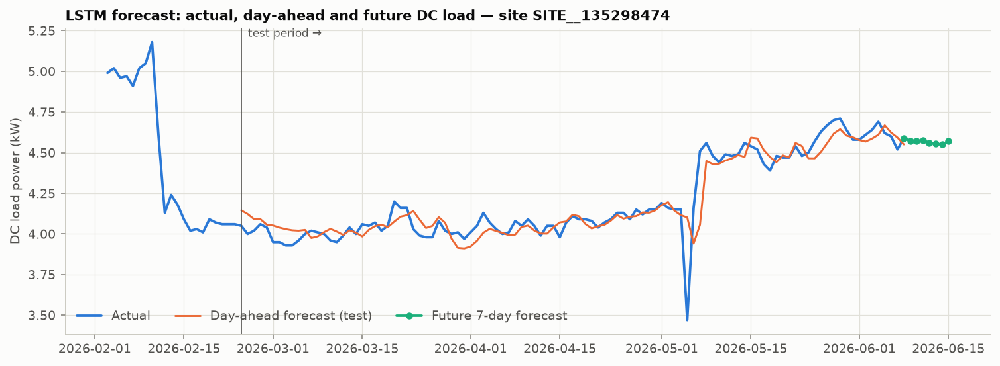

*Fig. 7 analogue.* At the representative site the day-ahead forecast follows the load closely. The single-day collapse on 5 May 2026 (a thermal incident, §4.3) is the kind of deviation the forecaster is *meant* to miss, which is what turns its residual into an anomaly signal. The green markers are the 7-day forecast beyond the last observed day.

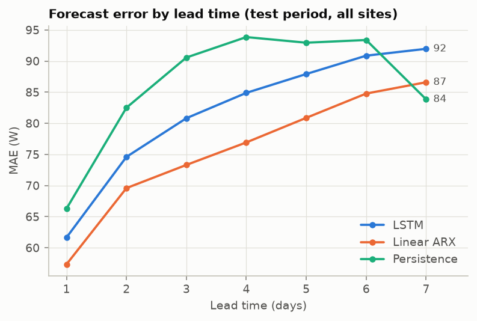

**By site group** (all test days):

| Group | Sites | MAE (W) | MAPE (%) | Skill vs persistence |
|---|---|---|---|---|
| DG (battery-cycled) | 347 | 82.9 | 1.52 | +0.44 |
| DG + solar | 88 | 60.7 | 1.31 | +0.19 |
| Grid | 889 | 53.5 | 1.24 | +0.08 |
| Outdoor | 1,079 | 72.6 | 1.40 | +0.29 |
| Indoor | 238 | 12.0 | 0.99 | +0.06 |

The model adds the most where load is least persistent: DG sites, and outdoor cabinets whose cooling follows the weather. Indoor shelters have flat loads that persistence already captures (MAPE 0.99 %, essentially the paper's 0.97 %).

**Ablation: why window-level normalisation was needed.** The first run scaled inputs only by each site's training-period mean, as a direct port of the paper's single-series normalisation would. Its LSTM was **worse than persistence** on all test days: RMSE 206.7 W vs 139.4 W, skill −1.20. It was fine on regular days (skill +0.35), but a handful of sites with structural load changes broke it. One site ran at 4.7× its training mean in the test period, far outside anything seen in training, so the saturating LSTM predicted ~11 σ when the truth was ~78 σ. The model also kept a seasonal bias toward the training-year level. Scaling each window by its own recent level removes both problems (`outputs/tables/ablation/`).

**Look-back window sensitivity** (10 epochs each, identical common test days):

| Look-back | MAE (W) | RMSE (W) | MAPE (%) | Skill vs persistence |
|---|---|---|---|---|
| 14 days | 62.0 | 123.1 | 1.32 | +0.22 |
| **28 days (used)** | 61.7 | 117.9 | 1.32 | +0.29 |
| 60 days (paper's window length) | 60.2 | 117.3 | 1.30 | +0.29 |

A longer look-back helps a little. The paper's 60 steps is marginally best, 1.4 W lower MAE than 28 days, at about twice the training cost and with 13 % fewer complete training windows; 14 days is clearly worse. The 28-day choice costs little, and the conclusions do not depend on it.

### 4.2 LSTM autoencoder (paper §IV-B, Table IV)

**Table IV — LSTM autoencoder (test windows; site-relative z units)**

| Metric | This study | Paper |
|---|---|---|
| MAE | 0.268 | 0.0264 |
| MSE | 0.410 | 0.0019 |
| RMSE | 0.640 | 0.0432 |
| R² | 0.842 | 0.9004 |
| Threshold | KDE 95th pct of clean **validation** errors = 0.974 | KDE 95th pct of training errors |
| Anomalies | 8,301 of 139,538 test site-days (5.95 %) | 930 of 70,621 (1.32 %) |

The error magnitudes are not comparable with the paper's: the paper's are on min–max-normalised features, ours on fleet-scaled z units. The R² is. Reconstructing six weakly correlated daily health indicators across 1,332 heterogeneous sites (R² 0.84) is harder than reconstructing six strongly correlated harmonic quantities of one panel (R² 0.90), but it is in the same range.

Fitting the threshold on in-sample training errors, as the paper did, would have given 1.18 instead of 0.974. In-sample errors are optimistic, and so is the resulting threshold. A 95th-percentile threshold flags ~5 % of normal days *by construction*, so the 5.95 % test flag rate means the test period holds only modestly more irregularity than validation. The paper's 1.32 % is not reproducible by that rule. Threshold choice is examined in §4.4.

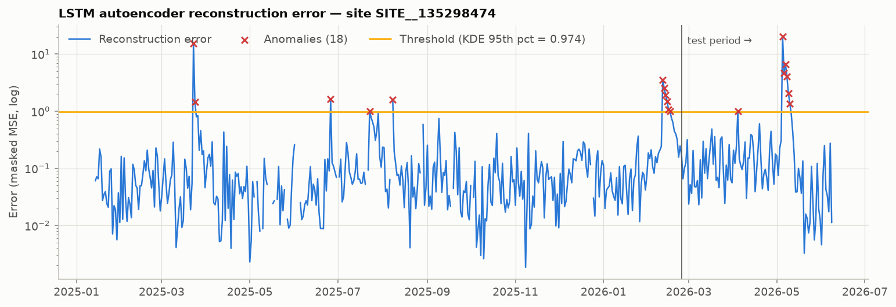

*Fig. 8 analogue.* As in the paper, anomalies arrive in **clusters** rather than isolated points:
* a March 2025 spike;
* a February 2026 cluster where DC load stepped down 20 % while RAN energy stayed flat. The DC/RAN ratio fell from 1.5 to 1.23, i.e. a non-radio load was removed;
* the May 2026 incident.

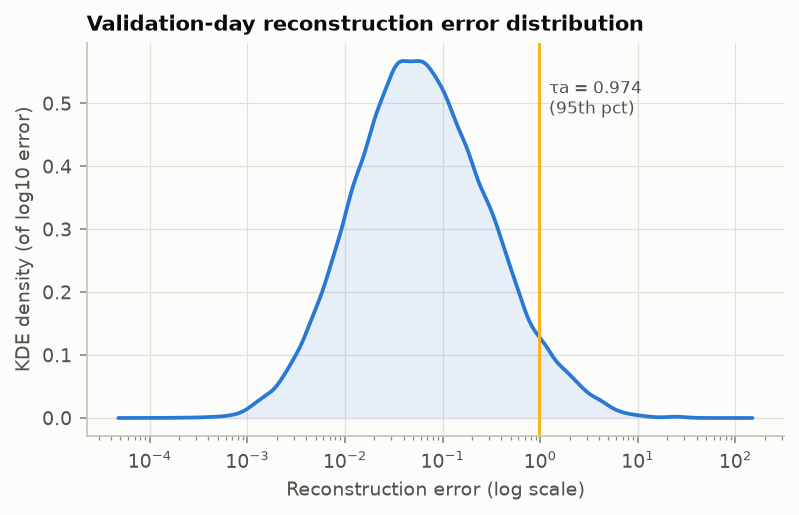

### 4.3 Hybrid decision output and root-cause analysis (paper §IV-C)

| Decision (test period) | Flagged site-days | Share | Sites affected |
|---|---|---|---|
| Forecast residual > τf (τf = 1.54 local σ ≈ 3.6 % load error) | 6,972 | 5.0 % | 1,111 |
| Reconstruction error > τa | 8,301 | 5.9 % | 844 |
| **Hybrid OR** (sensitivity) | 13,724 | 9.8 % | 1,227 |
| **Hybrid AND** (high confidence) | 1,549 | **1.1 %** | 389 |

**Agreement between the two detectors.** The paper reports "strong agreement between forecast residuals and reconstruction-based anomalies"; here it is quantified. A day flagged by the forecaster is 4.4× more likely to be flagged by the autoencoder (22.2 % vs 5.0 %). Overlap is still partial (Cohen's κ = 0.16, Jaccard 0.11), and that is the point of fusing them. The two detectors see different failure modes (§4.4), which is why OR raises coverage and AND raises confidence. The 7,559 OR episodes last a median of one day; 995 involve both detectors.

**The hybrid timeline at the representative site** (Fig. 8c below) shows the fusion working on a real incident. From 2 to 4 May 2026, battery temperature crept from 38 °C to 43 °C. On 5 May:
* average battery temperature hit 55.5 °C (maximum 66–68 °C);
* the mains supply dropped for 0.27 h and the LLVD disconnected load for 0.33 h;
* minimum load fell to 0.79 kW and the load swing tripled;
* RAN energy dropped 30 %.

By 7 May everything was back to normal, with battery temperature at 26 °C. This is consistent with a cooling failure and its repair. The forecaster flagged the load collapse and rebound, the autoencoder flagged six consecutive days, and AND flagged three. The diagnosis lists *battery thermal stress, DC bus voltage deviation, load disconnection (LLVD), load distortion*.

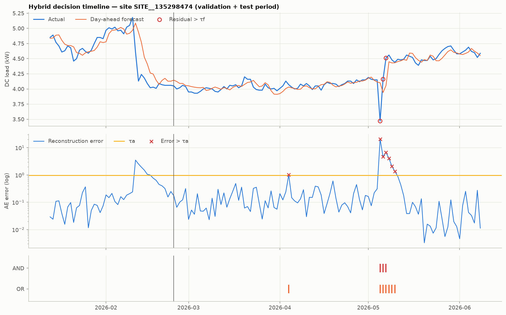

**Root-cause attribution** (Fig. 9 analogue):

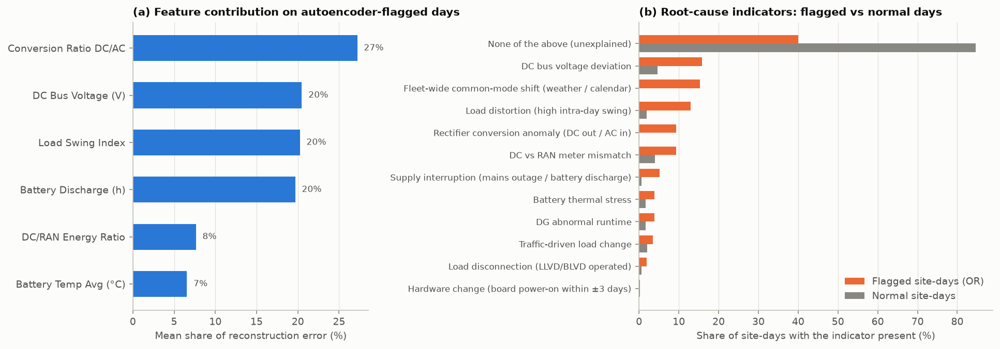

* **(a) What drives the autoencoder.** On autoencoder-flagged days the reconstruction error comes mainly from four indicators:
  * conversion ratio (27 %),
  * DC bus voltage (20 %),
  * load swing (20 %),
  * battery discharge (20 %).

  These are the supply-side quality indicators of a DC plant, the counterpart of the paper's finding that THD-A and THD-V dominate. The mean |z| of the conversion ratio is 3.8× higher on flagged days than on normal days, and battery discharge 3.7× higher.
* **(b) Diagnoses.** 75 % of AND days and 60 % of OR days carry at least one diagnostic indicator, against 15 % of normal days. The most frequent on AND days:
  * load distortion (29 %),
  * DC bus voltage deviation (27 %),
  * fleet-wide common-mode shift (14 %),
  * DC/RAN meter mismatch (12 %),
  * supply interruption (10 %),
  * load disconnection (7.6 %, against 0.6 % of normal days).

**Fleet-level finding without a counterpart in a single-panel study.** Fig. 10 shows days when up to **46 % of all sites** exceed τf at once. These are not 600 simultaneous faults. The forecaster sees only *past* weather, and on 28 February 2026 the temperature jumped 2.1 °C overnight. Across the test period, the daily median residual correlates with the day-to-day temperature change at r = 0.51. Subtracting each day's common-mode residual (median of all sites of the same type) handles this:
* 30 % of forecast flags turn out to be fleet-wide shifts rather than site faults;
* the number of sites with forecast flags drops from 1,111 to 949, at an unchanged false-alarm rate.

The adjustment removes the shared *shift* but not heterogeneous *responses*. Days such as Eid al-Adha (27 May) and the following heat surge still spike, because sites react differently. The proper fix is to give the forecaster day-ahead weather forecasts and a holiday calendar.

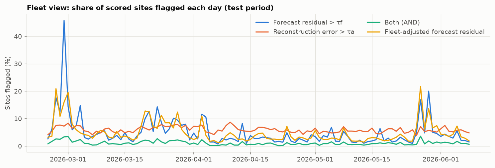

**Diagnostic output table** (top episodes by severity; the full table, 7,559 rows, is `outputs/tables/diagnostic_episodes.csv`):

| Site | Config | Period | Days (F / AE / both) | Diagnosis | What the data show |
|---|---|---|---|---|---|
| SITE__2911362865 | Grid, outdoor | 23 Mar – 6 May 2026 | 45 (9 / 44 / 8) | DC/RAN meter mismatch; conversion anomaly; voltage deviation | Rectifier-metered load jumped from ~1.05 kW to ~8 kW while RAN energy stayed at ~110 kWh/day. Before March the rectifier measured far less than the radios consumed: a metering / power-system re-homing change, not a real 7.7× load increase. |
| SITE__21799034 | Grid, outdoor | 24 Feb – 8 Jun 2026 | 105 (27 / 104 / 26) | DC/RAN meter mismatch; voltage deviation; load distortion | Same signature: metered load rose from ~1 kW to 7.6 kW in March with RAN energy flat at ~130 kWh/day. The DC/RAN ratio moved from 0.2–0.3 to the fleet-typical 1.37, i.e. the meter was corrected. The site stays flagged because its baseline is frozen at the training period (§5.3). |
| SITE__51229317 | DG, outdoor | 10 – 26 Mar 2026 | 17 (0 / 17 / 0) | DG abnormal runtime; conversion anomaly; supply interruption | On several days the generator ran 0 h and the site lived on batteries for 24 h, with the bus at ~49 V. The forecaster could not score this site because its NMS traffic / RAN counters are missing, so only the autoencoder saw it. |
| SITE__1273348749 | Grid, outdoor | 18 Apr – 8 Jun 2026 | 52 (9 / 52 / 9) | Supply interruption; conversion anomaly; voltage deviation; load distortion | A battery-discharge event on 4 May (4.5 h, bus 48.9 V), then a persistent conversion ratio above 1 (DC out > AC in): an AC-input metering inconsistency. |
| SITE__1350292149 | Grid, outdoor | 6 – 9 Apr 2026 | 4 (4 / 4 / 4) | Load disconnection (LLVD); voltage deviation; DC/RAN mismatch | LLVD operated for 6 h on 6 April. Mean bus voltage that day was 40.3 V and DC load fell 27 %. The mains counter logged no outage; both detectors fired on every day of the episode. |

### 4.4 Does the detector find real faults? (beyond the paper)

**Synthetic fault injection** (2,613 faults, ≈435 per type; recall = share detected on any affected day):

| Fault | Forecast | Autoencoder | **Hybrid OR** | **Hybrid AND** | OR on same days before injection |
|---|---|---|---|---|---|
| Load surge (non-radio, 1 d) | 100 % | 94 % | **100 %** | **94 %** | 10 % |
| Load drop (sector outage, 1–3 d) | 100 % | 10 % | **100 %** | 10 % | 18 % |
| Supply interruption (1–2 d) | 9 % | 100 % | **100 %** | 8 % | 13 % |
| RAN meter drift (3–5 d) | 41 % | 98 % | **99 %** | 40 % | 25 % |
| Battery overheating (2–4 d) | 13 % | 74 % | **77 %** | 8 % | 21 % |
| Rectifier efficiency loss (3–5 d) | 17 % | 19 % | 30 % | 5 % | 24 % |
| **All faults** | 47 % | 66 % | **84 %** | 28 % | 18.5 % |

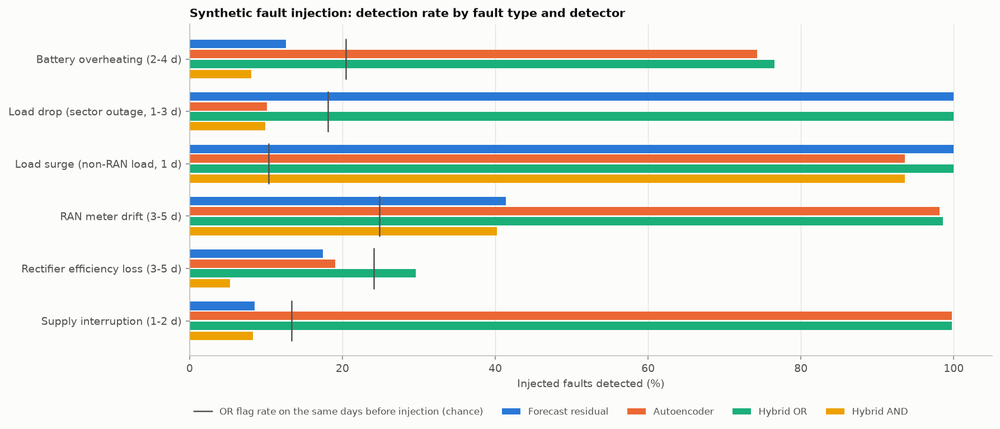

This is the strongest support for the paper's design.
* **The two detectors are complementary.**
  * The forecaster catches every load-level fault but is blind to supply, thermal and metering faults that leave the load unchanged.
  * The autoencoder catches those but misses a sector outage, which scales load and RAN energy together and so leaves the ratios intact.
  * **OR lifts recall from 47 % / 66 % to 84 %**, at a 10.2 % flag rate on unaffected days.
* **AND is high-confidence, as claimed.** It fires on only 1.1 % of unaffected days, and its hits concentrate on faults that disturb both load and health, such as non-radio load surges.
* **The limitation:** an 8–20 % rectifier efficiency loss stays near chance. At daily resolution it is hidden inside the normal day-to-day swings of the conversion ratio caused by battery recharge.

**Threshold choice.** The 95th percentile is the paper's choice, but it is too permissive for a fleet. At 1,332 sites it means ~130 OR alarms a day. Fault-injection recall vs flag rate on unaffected days:

| KDE percentile | OR recall | OR flags / 1,000 site-days | AND recall | AND flags / 1,000 site-days |
|---|---|---|---|---|
| 95 (paper) | 84 % | 102 | 28 % | 10.6 |
| 99 | 68 % | 25 | 14 % | 2.1 |
| 99.5 | 64 % | 15 | 10 % | 1.3 |

Moving to the 99.5th percentile cuts OR alarms by 85 % while keeping three-quarters of the recall. For fleet operations that is the better operating point.

**Real operational events as weak labels.** These events are logged by the NMS but are *not* model inputs. Enrichment = P(event | flagged) / P(event | not flagged):

| Event (test period) | Event site-days | Autoencoder | Hybrid OR | Hybrid AND | Share of event days caught by OR |
|---|---|---|---|---|---|
| Mains outage ≥ 1 h (grid sites) | 157 | 29× | 14× | **32×** | 50 % |
| Load disconnection (LLVD/BLVD operated) | 984 | 4.8× | 3.2× | **12×** | 26 % |
| DG abnormal runtime (DG sites) | 2,670 | 1.3× | 1.3× | 1.2× | 20 % |
| Hardware board power-on within ±3 days | 298 | 0.9× | 1.1× | 2.1× | 11 % |

Flags concentrate strongly on real outages and load disconnections; for outages, part of the signal arrives through the battery-discharge input. There is little signal for DG "abnormal runtime", which is logged on 5.8 % of DG site-days and so looks like routine generator behaviour rather than a fault. Hardware power-ons rarely produce a visible anomaly: new boards mostly enter service without a detectable change in daily DC load.

---

## 5. Discussion

### 5.1 Paper vs this study

| | Paper | This study |
|---|---|---|
| Scope | 1 panel, ~50 days, high-frequency | 1,332 sites, 524 days, daily |
| Forecast MAE / RMSE / MAPE / R² | 61.1 W / 135.8 W / 0.97 % / 0.967 | 61.6 W / 117.8 W / 1.32 % / 0.996 (median per-site R² 0.64) |
| Forecast vs simple baselines | not reported | beats persistence (skill +0.29); does not beat linear ARX |
| AE reconstruction R² | 0.900 | 0.842 |
| Anomalies flagged | 1.32 % (AE) | 5.9 % (AE), 1.1 % (AND), 9.8 % (OR) |
| Dominant root-cause indicators | THD-A, THD-V (waveform quality) | conversion ratio, DC bus voltage, load swing, battery discharge (DC-plant supply quality) |
| Detection validated | no labels | 84 % fault-injection recall (OR); 32× enrichment for real outages (AND) |

### 5.2 What transferred and what did not

* **The architecture transfers.** Pairing a forecaster, which tracks *how much* energy is used, with an autoencoder over quality indicators, which tracks *how healthy* the supply is, gives two detectors with different blind spots. The OR/AND fusion behaves as the paper describes, and the injection study makes that visible fault type by fault type.
* **The quality indicators must be re-derived for the domain.** A DC power plant has no harmonics. Its "power quality" is conversion efficiency, bus voltage, battery behaviour and the consistency between independent meters, and those indicators carry the root-cause signal here, just as THD did for the building panel.
* **The forecasting claims do not transfer unqualified.** At daily granularity an LSTM is not clearly better than a linear model, and R² is uninformative without baselines. Neither issue is visible in a single-series study without a persistence comparison.
* **Fleet scale introduces problems a single panel never meets:** non-stationary site levels (hence window-level normalisation), heterogeneous sites (hence site-relative scaling), common-mode weather and holiday shocks (hence the fleet adjustment), and alarm volume (hence a stricter threshold).

### 5.3 Limitations

* **Daily resolution** hides intra-day dynamics. Short transients, and efficiency losses smaller than the daily variation, are out of reach.
* **One weather station** serves a whole region, and coordinates are anonymised, so local weather cannot be resolved.
* **No ground-truth fault labels.** Injected faults are simplified, single-mechanism perturbations; the operational events are weak labels and partly reflected in the inputs (outages → battery discharge).
* **Frozen baselines.** Site-relative scaling uses the training period. After a legitimate permanent change (a metering correction, new hardware, a re-homed power system) a site stays flagged until it is re-baselined. Two of the top five episodes are exactly this. An "acknowledge and re-baseline" workflow, or the online learning the paper proposes as future work, is needed in operation.
* **The root-cause rules** use a fixed |z| ≥ 3 and fire on 15 % of normal days, so a diagnosis is a lead for an engineer, not a verdict.
* **The forecaster sees only past weather.** Day-ahead weather forecasts and a holiday calendar are the obvious next inputs.

---

## 6. Conclusion

Applied to 1,332 telecom sites, the paper's hybrid LSTM forecasting + LSTM-autoencoder framework reproduces its headline behaviour:
* accurate short-term load forecasts (day-ahead MAE 61.6 W, MAPE 1.32 %);
* an autoencoder that learns normal power-system health (R² 0.84);
* an OR/AND fusion that trades sensitivity for confidence;
* root-cause attribution that points at physically meaningful indicators.

The added validation shows the fusion is worth it. OR catches 84 % of injected faults that neither detector catches alone at more than 66 %, and AND-flagged days are 32× enriched for real mains outages and 12× for load disconnections.

The study also tempers the paper in four ways:
* the LSTM's forecasting edge over a linear model with the same inputs is not established at daily resolution;
* pooled R² should not be reported without baselines;
* a fleet deployment needs window-level normalisation, common-mode adjustment and a stricter (99th–99.5th percentile) threshold.

Future work, in line with the paper's own outlook, is online threshold adaptation per site group, day-ahead weather and calendar covariates, and higher-resolution rectifier telemetry for efficiency faults.

---

## 7. Reproducing

```bash
pip install -r requirements.txt
python run_study.py                  # full pipeline, ~1 h on 4 CPU cores
python run_study.py sensitivity      # look-back window ablation
```

All randomness is seeded. Every number in this report comes from `outputs/tables/` (digest: `outputs/RESULTS.md`), and every figure from `outputs/figures/`.
